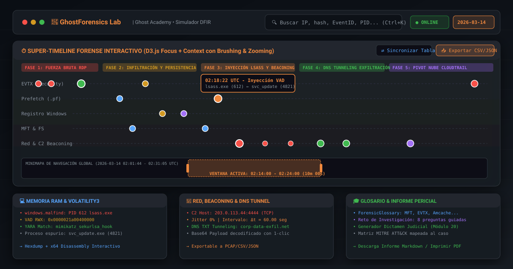
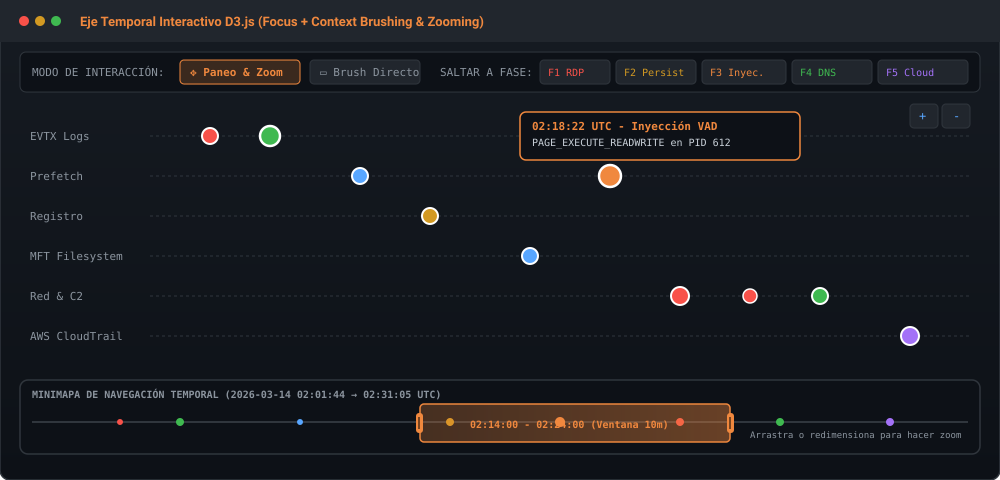
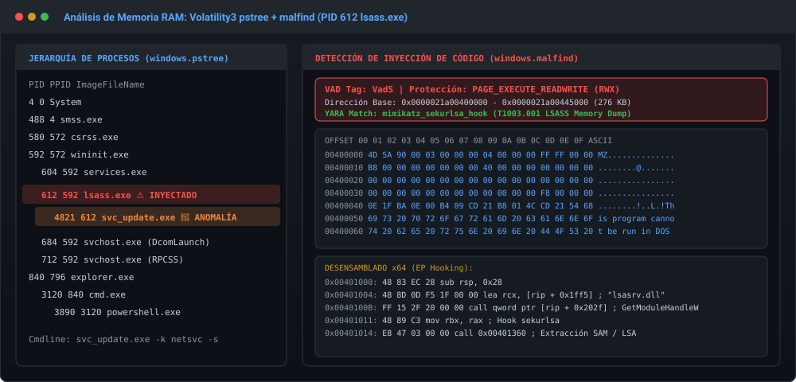
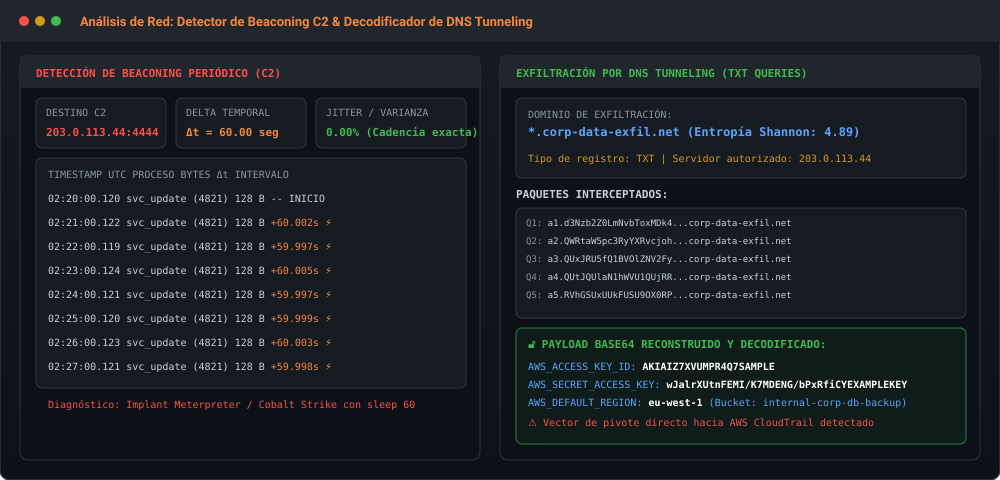
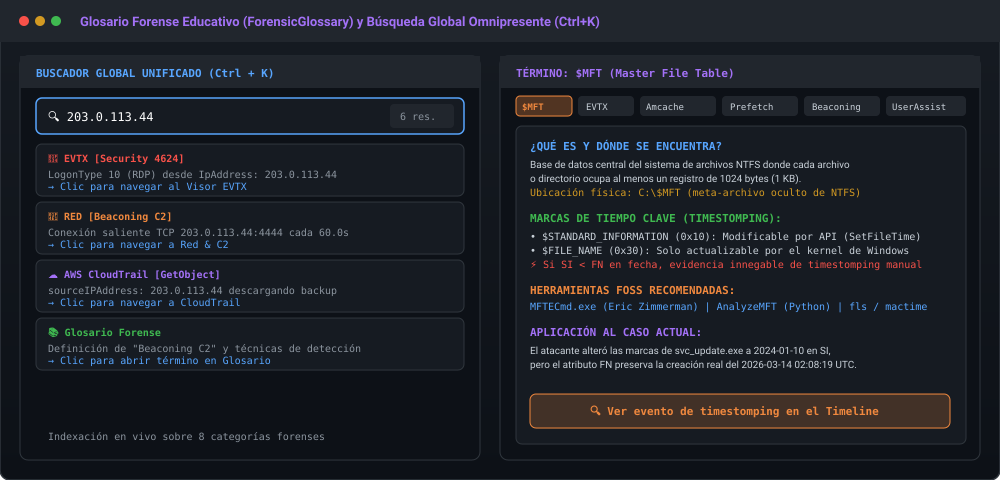

# 👻 GhostForensics Lab

<div align="center">


### Simulador Interactivo de Investigación Forense Digital (DFIR) y Respuesta a Incidentes
**Ghost Academy — Curso de Informática Forense y Análisis Pericial (21 Módulos)**

[](LICENSE)
[](https://vitejs.dev/)
[](https://react.dev/)
[](https://www.typescriptlang.org/)
[](https://d3js.org/)
[](https://tailwindcss.com/)
[](https://github.com/features/actions)
[](https://unfantasmaenelsistema.github.io/GhostForensicsLab/)

### 🚀 [**Abrir GhostForensics Lab**](https://unfantasmaenelsistema.github.io/GhostForensicsLab/)

<p align="center">
  <a href="#-vista-previa-del-laboratorio">Vista Previa</a> •
  <a href="#-qué-es-ghostforensics-lab">¿Qué es?</a> •
  <a href="#-módulos-y-capacidades-forenses">Módulos</a> •
  <a href="#-datos-del-caso-investigado">Caso Pericial</a> •
  <a href="#-inicio-rápido-en-local">Ejecución Local</a> •
  <a href="#-enlaces-oficiales">Enlaces</a>
</p>

</div>

---

## 📸 Vista Previa del Laboratorio

### Dashboard Principal y Super-Timeline con Eje Temporal D3.js Focus + Context


### Navegación Temporal con Brushing, Zooming Dinámico y Carriles de Artefactos


### Análisis de Volcado de Memoria RAM (Volatility3, malfind, RWX y Hooking)


### Análisis de Comunicaciones C2 (Detector de Beaconing y Decodificador DNS Tunneling)


### Buscador Global Unificado (`Ctrl + K`) y Glosario Pedagógico (ForensicGlossary)


---

## 🎯 ¿Qué es GhostForensics Lab?

**GhostForensics Lab** es una plataforma web profesional, 100% estática, ligera y de alto rendimiento diseñada específicamente para los alumnos de **Ghost Academy** y profesionales de ciberseguridad / respuesta a incidentes (DFIR). 

Funciona como un **laboratorio forense interactivo** que reproduce con máxima fidelidad técnica los artefactos, logs, comandos y sintaxis de las herramientas de referencia de código abierto (FOSS) estudiadas en el curso:

- **Análisis de Memoria RAM:** Volatility3 (`windows.pstree`, `windows.pslist`, `windows.malfind`, `windows.cmdline`, `vadinfo`).
- **Análisis de Registro y Sistema de Archivos:** Eric Zimmerman Tools (`MFTECmd`, `RECmd`, `PECmd`, `AmcacheParser`).
- **Análisis de Eventos de Windows:** Windows Event Viewer, `EvtxECmd` y `Hayabusa` (Event IDs 4624, 4625, 4672, 4688, 7045, 1102).
- **Tráfico de Red y Beaconing:** Wireshark, Zeek, `windows.netscan`, análisis de dispersión $\Delta t$, cálculo de jitter y decodificación de **DNS Tunneling**.
- **Forense Cloud:** AWS CloudTrail JSON events (S3 Data Exfiltration, IAM Persistence, Bucket Policy Tampering).
- **Reconstrucción Táctica:** Mapeo formal a la matriz **MITRE ATT&CK** y redacción de informe pericial judicial estructurado (Módulo 20).

> 💡 **Objetivo pedagógico:** Esta herramienta no reemplaza la instalación en máquinas virtuales de las herramientas periciales reales, sino que ofrece a los alumnos un entorno accesible desde cualquier navegador y dispositivo para entrenar su **pensamiento analítico**, su **capacidad de correlación cruzada** y la **reconstrucción cronológica de intrusiones complejas** sin requerir descargas pesadas de volcados de 32 GB.

---

## 🛠️ Módulos y Capacidades Forenses

| # | Módulo | Descripción Técnica y Características |
|---|---|---|
| **1** | **Super-Timeline (D3.js Focus + Context)** | Eje temporal horizontal interactivo renderizado con **D3.js v7**. Dispone de arquitectura *Focus + Context*: minimapa con caja de brushing arrastrable y redimensionable, zoom con rueda o controles táctiles, presets rápidos por fase del ataque, 6 carriles segmentados por artefacto ($MFT, Registro, Prefetch, EVTX, Red, Cloud), filtro sincronizado en tiempo real con la tabla de eventos e inspección de timestomping ($SI vs $FN). |
| **2** | **Visor de Registro de Windows** | Explorador de colmenas (`SOFTWARE`, `SYSTEM`, `NTUSER.DAT`, `Amcache.hve`). Incluye persistencia en clave `Run` (`WindowsUpdateSvc`), decodificación automática ROT13 en `UserAssist` y comandos equivalentes de `RECmd` listos para copiar. |
| **3** | **Visor de Event Logs (EVTX)** | Visor de eventos Security y System con filtrado instantáneo por Event ID (4624, 4625, 4672, 4688, 7045, 1102). Ofrece vista detallada estructurada con tipos de Logon (RDP LogonType 10) y vista XML cruda idéntica a la herramienta nativa de Windows. |
| **4** | **Memoria RAM (Volatility3)** | Árbol jerárquico de procesos (`pstree`), detección de procesos descolgados anómalos (`svc_update.exe` con PID 4821 hijo ilegítimo de `lsass.exe`), plugin `malfind` con volcado de memoria RWX (`PAGE_EXECUTE_READWRITE`), hexdump interactivo, desensamblado x64 y match con regla YARA `mimikatz_sekurlsa_hook`. |
| **5** | **Red y C2 Beaconing** | Tabla `netscan` de conexiones activas, analizador matemático de *beaconing* con medición de cadencia ($\Delta t = 60.00$ s) hacia `203.0.113.44:4444`, inspector de **DNS Tunneling** con decodificación en vivo del payload Base64 exfiltrado (credenciales AWS IAM) e inspector de paquetes al estilo Wireshark. |
| **6** | **Cloud Forensics (AWS CloudTrail)** | Detección de compromiso en la nube originado desde la misma IP pública del atacante (`203.0.113.44`): llamada a `GetObject` para exfiltrar base de datos corporativa en S3, alteración de `PutBucketPolicy` y creación de llave de persistencia IAM secundaria (`CreateAccessKey`). |
| **7** | **Modo Caso / Reto Pericial** | Investigación interactiva gamificada con 8 preguntas periciales progresivas. Enlaces directos a las evidencias correspondientes, retroalimentación técnica inmediata y reconstrucción gráfica de la Cadena de Ataque. |
| **8** | **Generador de Informe Pericial** | Redactor de dictamen judicial formal conforme al Módulo 20 del curso: Resumen ejecutivo, cadena de custodia, cronología de hechos, análisis por vector, matriz MITRE ATT&CK y conclusiones periciales. Exportable a **Markdown (.md)** o imprimible/guardable en **PDF**. |
| **9** | **Glosario Forense (ForensicGlossary)** | Centro pedagógico con definiciones exhaustivas, ubicaciones de artefactos, herramientas FOSS sugeridas, consejos prácticos para el perito y anclaje al caso práctico para conceptos clave: `$MFT`, `EVTX`, `Amcache.hve`, `Prefetch (.pf)`, `Beaconing C2`, `UserAssist`, `VAD malfind` y `DNS Tunneling`. |
| **10** | **Buscador Global Unificado (`Ctrl + K`)** | Modal de búsqueda omnipresente en la barra superior. Indexa en tiempo real todos los registros de los 8 módulos (Timeline, Logs, Registro, Procesos de Memoria, Conexiones, DNS, CloudTrail y Glosario) por palabras clave, hashes SHA-256, IPs, PIDs o EventIDs, permitiendo saltar a cualquier evidencia con un solo clic. |
| **11** | **Exportación de Datos (CSV & JSON)** | Botón de exportación en cada uno de los 6 visores forenses principales para descargar los datos filtrados en tiempo real: formato `.csv` (con UTF-8 BOM para apertura nativa en Microsoft Excel y herramientas de Eric Zimmerman) y `.json` estructurado con metadatos del caso para análisis offline. |

---

## 🔍 Datos del Caso Investigado

Todos los artefactos, marcas de tiempo y entidades corresponden a un caso forense unificado e internamente coherente:

- **Host comprometido:** `WORKSTATION-09` (Windows 11 Enterprise, IP `10.0.2.15`).
- **Cuenta vulnerada:** `WORKSTATION-09\administrator`.
- **IP Atacante externa:** `203.0.113.44` (Rango de prueba RFC 5737).
- **Puerto de C2:** `4444` (TCP Meterpreter / Cobalt Strike implant).
- **Proceso malicioso inicial:** `C:\Windows\Temp\svc_update.exe` (PID `4821`).
- **Proceso del sistema inyectado:** `C:\Windows\System32\lsass.exe` (PID `612`).
- **Ventana temporal del incidente:** `2026-03-14 02:01:44 UTC` a `02:31:05 UTC`.
- **Técnicas MITRE ATT&CK identificadas:**
  - `T1110.001` — Brute Force: Password Guessing (RDP).
  - `T1078.003` — Valid Accounts: Local Accounts.
  - `T1547.001` — Boot or Logon Autostart Execution: Registry Run Keys.
  - `T1055.001` — Process Injection: Dynamic-link Library Injection.
  - `T1003.001` — OS Credential Dumping: LSASS Memory.
  - `T1071.001` — Application Layer Protocol: Web/C2 Protocols.
  - `T1071.004` — DNS Tunneling Data Exfiltration.
  - `T1098.001` — Account Manipulation: Additional Cloud Credentials.
  - `T1537` — Data Transfer to Cloud Account.
  - `T1070.001` — Indicator Removal: Clear Windows Event Logs (Event ID 1102).

---

## 💻 Inicio Rápido en Local

### Requisitos previos
- **Bun**: versión 1.x o superior ([bun.sh](https://bun.sh)). El proyecto se instala y compila con Bun (`bun.lock` es el lockfile comprometido); `npm install` puede fallar por un conflicto de peer-dependencies entre `esbuild` y `vite` que Bun resuelve sin problema.

### Pasos de instalación
```bash
# 1. Clonar el repositorio
git clone https://github.com/unfantasmaenelsistema/GhostForensicsLab.git
cd GhostForensicsLab

# 2. Instalar dependencias
bun install

# 3. Iniciar el entorno de desarrollo
bun run dev
```

Abre tu navegador en `http://localhost:3000` para comenzar a interactuar con el laboratorio.

### Comandos disponibles
```bash
bun run dev        # Inicia el servidor de desarrollo Vite en el puerto 3000
bun run build      # Compila la versión de producción optimizada en la carpeta dist/
bun run preview    # Previsualiza la compilación localmente
bun run lint       # Ejecuta la comprobación estricta de tipos de TypeScript (tsc --noEmit)
bun run clean      # Limpia directorios de compilación residuales
```

---

## 📂 Estructura del Proyecto

```
ghostforensics-lab/
├── .github/
│   └── workflows/
│       └── deploy.yml            # Pipeline automatizado de GitHub Actions para GitHub Pages
├── docs/
│   └── screenshots/              # Capturas y diagramas de alta resolución para el README
│       ├── hero_dashboard.svg
│       ├── timeline_d3_zoom.svg
│       ├── memory_volatility.svg
│       ├── network_beaconing_dns.svg
│       └── glossary_and_search.svg
├── public/
│   └── icono.png                 # Isotipo oficial de Ghost Academy
├── src/
│   ├── assets/                   # Logotipo oficial base64 de Un Fantasma en el Sistema
│   ├── components/
│   │   ├── InteractiveTimelineAxis.tsx   # Eje temporal D3.js (Focus + Context, Brushing & Zooming)
│   │   ├── TimelineExplorer.tsx          # Tabla y filtros del super-timeline forense
│   │   ├── RegistryViewer.tsx            # Árbol de colmenas de Registro de Windows
│   │   ├── EventLogsViewer.tsx           # Visor EVTX con decodificador XML
│   │   ├── MemoryViewer.tsx              # Volatility3 pstree + malfind VAD injection
│   │   ├── NetworkViewer.tsx             # Conexiones netscan + Beaconing + DNS Tunneling
│   │   ├── CloudTrailViewer.tsx          # AWS CloudTrail auditor
│   │   ├── InvestigationView.tsx         # Modo Caso con 8 preguntas periciales y feedback
│   │   ├── ForensicReportGenerator.tsx   # Generador de informe pericial formal (Módulo 20)
│   │   ├── ForensicGlossary.tsx          # Glosario pedagógico con términos forenses clave
│   │   ├── GlobalSearchModal.tsx         # Buscador global unificado con atajo Ctrl+K
│   │   ├── ExportViewButton.tsx          # Módulo de exportación de datos en CSV y JSON
│   │   └── Navbar.tsx                    # Barra superior con buscador, temas y exportación
│   ├── data/
│   │   └── forensicData.ts               # Base de datos pericial unificada del caso
│   ├── types/
│   │   └── index.ts                      # Tipos de TypeScript para eventos y artefactos
│   ├── App.tsx                           # Layout principal y enrutamiento por pestañas
│   ├── main.tsx                          # Punto de entrada de React 19
│   └── index.css                         # Estilos globales y utilidades de Tailwind CSS
├── .gitignore                            # Exclusiones de Git (node_modules, dist, etc.)
├── index.html                            # Documento HTML con metadatos SEO y OpenGraph
├── package.json                          # Scripts y dependencias del proyecto
├── tsconfig.json                         # Configuración de compilación de TypeScript
├── vite.config.ts                        # Configuración del empaquetador Vite
└── README.md                             # Documentación completa del proyecto
```

---

## 🎨 Identidad de Marca Ghost Academy

- **Fondo oscuro por defecto:** `#0d1117`, tarjetas `#161b22`, bordes `#30363d`, acento principal naranja `#f0883e`.
- **Tema claro conmutable:** Accesible desde la barra de navegación con sincronización en `localStorage`.
- **Portabilidad de la Investigación:** Los alumnos pueden guardar, exportar e importar en formato `.json` todo el progreso de sus respuestas y deducciones para continuar la práctica en cualquier otro equipo o navegador.

---

## 🔗 Enlaces Oficiales

- 🚀 **Demo en vivo:** [GhostForensics Lab](https://unfantasmaenelsistema.github.io/GhostForensicsLab/)
- 🌐 **Web Oficial:** [Un Fantasma en el Sistema](https://www.unfantasmaenelsistema.com/)
- 🎓 **Plataforma del Curso:** [Ghost Academy](https://ghostacademy.unfantasmaenelsistema.com/)
- 🛒 **Tienda de Ciberseguridad:** [Ghostore](https://www.ghostore.unfantasmaenelsistema.com/)

---

<div align="center">

*GhostForensics Lab es un proyecto didáctico desarrollado para los alumnos del curso de Informática Forense y Respuesta a Incidentes de Ghost Academy.*  
*Hecho con dedicación para la comunidad de DFIR y ciberseguridad.*

</div>
